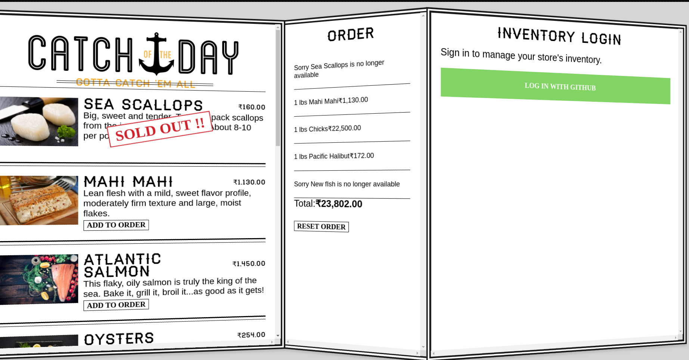
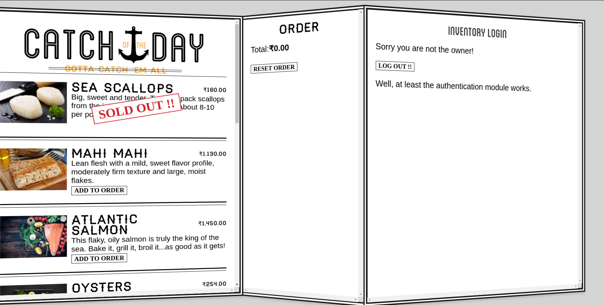
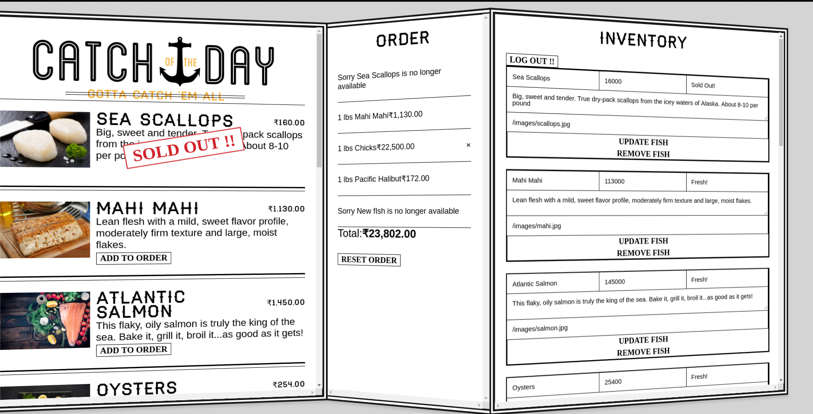

# Catch of the Day (COTD)
## [Deployed App](http://cotdv2048.herokuapp.com) | [Blog Post](https://mixstersite.wordpress.com/2019/01/18/tutorialreactjs-hasuragraphql-apollo-firebase/)

Authentication Page

A powerful but simple react fish store app fueled by Hasura's GraphQL Engine, Apollo, and Firebase.

## Stack  
1) ReactJS,
2) Firebase,
3) Hasura's GraphQL Server,
4) Deployment on Heroku,
5) Apollo

## Features
**Available to All**
- Add to Order
- Update Order
- Delete Order
- Reset Order 
- Menu
- Authentication

User Authentication view

**Only visible to Owner**
- Add Inventory
- Update Inventory
- Delete Inventory

Owner Authentication view 

## Credits & References
- Credit that is due goes to the great course by Web Bos for [ReactJS](https://reactforbeginners.com)
- I was supported throughout the development process by [Hasura](https://hasura.io)'s developer community on [Discord](https://discord.gg/vBPpJkS)
- JS from [TutorialsPoint](https://www.tutorialspoint.com/javascript/]
- [ES6 JS6](https://www.tutorialspoint.com/es6/)
- [GraphQL](https://www.howtographql.com/)
- Hasura GraphQL engine - [community example - poll](https://www.smashingmagazine.com/2018/12/real-time-app-graphql-subscriptions-postgres/)
- [Documentation](https://docs.hasura.io/1.0/graphql/) - Hasura GraphQL
- GraphQL with [examples](https://www.predic8.de/graphql-query-samples.htm)
- [3 Factor App](https://3factor.app/)
- [Firebase auth](https://firebase.google.com/docs/auth)
 and many more that helped in the long run ..

Landing Page

## License 
This source code is under [MIT license](https://github.com/vipulgupta2048/react-cotd/blob/master/LICENSE)
